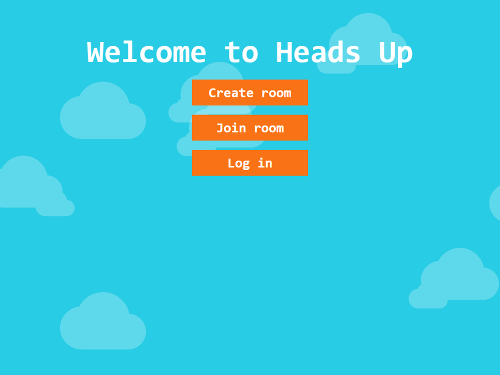

# Heads Up Clone

This is a web version of the famous game "Heads Up" built with the MERN stack, and webRTC.



# Features

- Play the game through a real time communication (video and audio)
- JWT authentication (refresh and access token) with argon2
- Linear gameplay with single source of truth (websockets)

# Tech stack
- ## Language
    - [TypeScript] - Superset of JavaScript that offers built-in static types
- ## Frontend
    - [React.js] - Easy to use, component based frontend library
    - [Material UI] - React.js UI tool with wide variety of icons and other components
    - [Agora.io] - webRTC made easy
- ## Backend
    - [Node.js] - Most popular environment for Javascript
    - [Express.js] - Most popular backend Javascript framework
    - [Socket.io] - Easy to configure event-based websocket library
- ## Database
    - [Redis] - In-memory data store perfect for caching authentication tokens
    - [MongoDB] - NoSQL database that perfectly pairs with JavaScript

## Run on local machine
1. Clone the repository
```sh
git clone https://github.com/TselmuunUranchimeg/Heads-Up-Clone
```
2. Install front-end packages
```sh
npm install
```
3. Install back-end packages
```sh
cd server; npm install
```
4. Create .env file in "server" and add environment variables

| Name | Description |
| --- | --- |
| **AUDIENCE** | Frontend URL |
| **PORT** | Port number of the server |
| **JWT_SECRET** | JWT secret value |
| **ISSUER** | Server URL |
| **DATABASE** | Link to the MongoDB database |
| **APP_ID** | App id of project on Agora.io |
| **APP_CERTIFICATE** | App certificate of project on Agora.io |
| **REDIS_ENDPOINT** | Redis link |
| **REDIS_PASSWORD** | Password for the database |

5. Start frontend and backend
```sh
npm run start
```
```sh
cd server; npm run dev
```

[Node.js]: <https://nodejs.org>
[Material UI]: <https://mui.com>
[Express.js]: <https://expressjs.com>
[React.js]: <https://reactjs.org>
[Socket.io]: <https://socket.io>
[Redis]: <https://redis.com>
[MongoDB]: <https://mongodb.com>
[Agora.io]: <https://agora.io>
